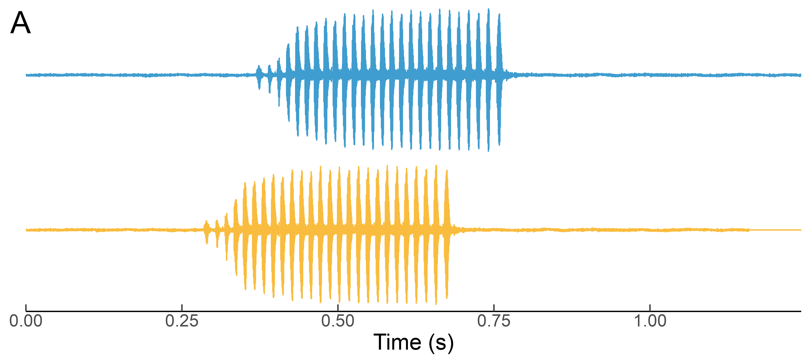
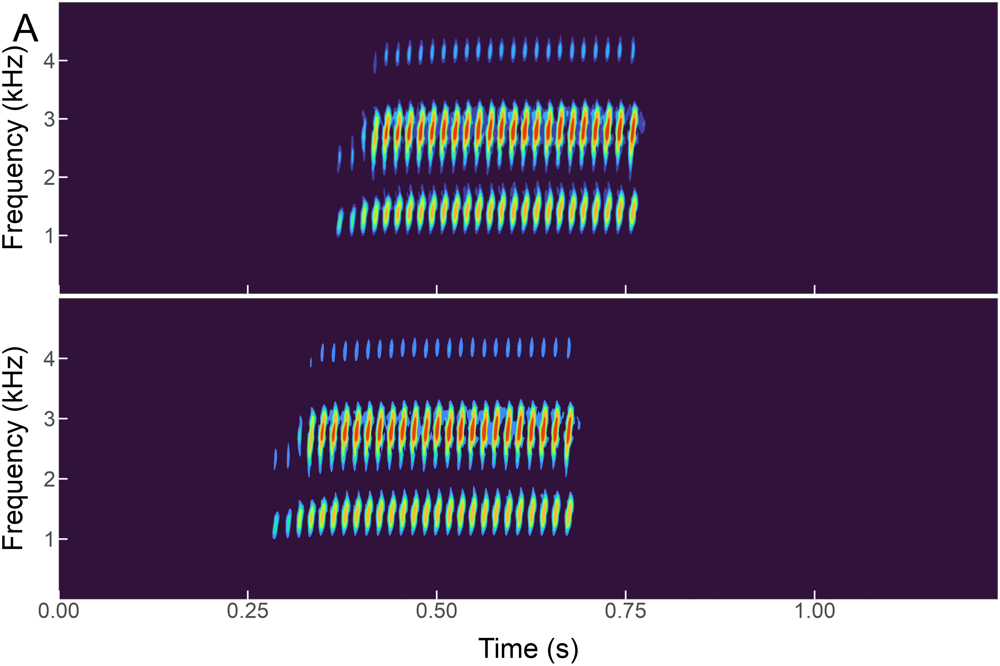

<!-- Short Description  -->
Code for making oscillograms and spectrograms of stereo files using ggplot2.

<!-- README.md is generated from README.Rmd. Please edit that file -->

<!-- ## Status -->
<!-- Project is: _in progress_ -->

<h2> Examples</h2>

    
  

<h2> Contact</h2>
Created by [Matías I. Muñoz](https://sites.google.com/view/matiasmunozsandoval/contact?authuser=0) (<ma.munozsandoval@gmail.com>)